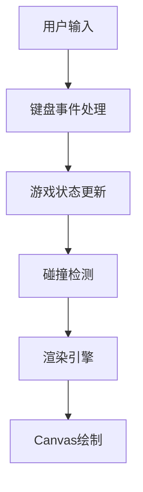

## 1. Architecture Design
纯前端项目，使用HTML5 Canvas进行游戏渲染，JavaScript处理游戏逻辑。



## 2. Technology Description
- 前端：HTML5 + CSS3 + Vanilla JavaScript
- 渲染：HTML5 Canvas 2D API
- 开发工具：无需框架，原生JS实现
- 部署：静态HTML文件，可直接在浏览器运行

## 3. Core Game Objects
### 3.1 Mech (机甲)
```javascript
class Mech {
  x: number;           // X坐标
  y: number;           // Y坐标
  width: number;       // 宽度
  height: number;      // 高度
  health: number;      // 血量
  maxHealth: number;   // 最大血量
  color: string;       // 颜色
  isAttacking: boolean;// 是否在攻击
  isDefending: boolean;// 是否在防御
  attackCooldown: number; // 攻击冷却
  facingRight: boolean;   // 朝向
}
```

### 3.2 Game State (游戏状态)
```javascript
const gameState = {
  mechs: [Mech, Mech],  // 两个机甲
  gameOver: boolean,    // 游戏是否结束
  winner: number | null // 获胜者索引
}
```

## 4. Game Loop
1. **Input Handling** - 监听键盘事件，更新机甲状态
2. **Update** - 移动机甲、处理攻击、检测碰撞
3. **Render** - 清空画布、绘制背景、绘制机甲、绘制UI
4. **Repeat** - 约60fps循环

## 5. File Structure
```
/
├── index.html      # 主HTML文件
└── README.md       # 说明文档
```

## 6. Key Functions
- `createMech(x, y, color)` - 创建机甲对象
- `updateMech(mech, input)` - 更新机甲状态
- `checkCollision(mech1, mech2)` - 碰撞检测
- `handleAttack(attacker, defender)` - 攻击处理
- `renderGame()` - 渲染游戏画面
- `drawMech(ctx, mech)` - 绘制机甲
