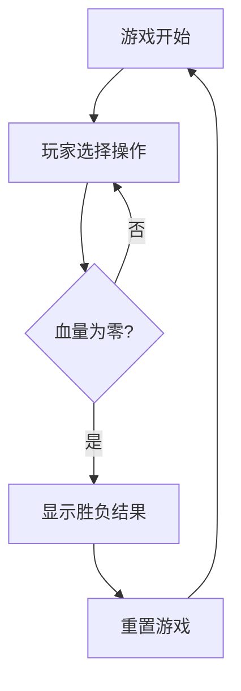

## 1. Product Overview
像素风机甲对战小游戏是一款复古风格的双人对战游戏，玩家控制各自的机甲进行移动、攻击和防御，通过降低对方血量来获胜。
- 主要用途：娱乐休闲，适合双人本地对战
- 目标用户：喜欢复古像素风格游戏的玩家

## 2. Core Features

### 2.1 User Roles
| Role | Registration Method | Core Permissions |
|------|---------------------|------------------|
| Player 1 | WASD键控制 | 移动、攻击、防御 |
| Player 2 | 方向键控制 | 移动、攻击、防御 |

### 2.2 Feature Module
1. **游戏主界面**: 游戏场景、机甲角色、操作按钮、血量显示
2. **游戏控制**: 键盘操作支持、角色动画、碰撞检测
3. **胜负判定**: 血量系统、胜负提示、重置功能

### 2.3 Page Details
| Page Name | Module Name | Feature description |
|-----------|-------------|---------------------|
| 游戏主界面 | 场景渲染 | 像素风格的战斗场景，包含地面、背景等 |
| 游戏主界面 | 角色渲染 | 两个机甲角色，包含站立、攻击、防御动画 |
| 游戏主界面 | 操作面板 | 显示操作说明和功能按钮 |
| 游戏主界面 | 状态显示 | 实时显示双方血量条和当前状态 |

## 3. Core Process
游戏开始后，两名玩家分别控制自己的机甲，通过移动接近对方，使用攻击技能造成伤害，使用防御技能减少受到的伤害。当一方血量归零时，游戏结束并显示获胜者。

## 4. User Interface Design
### 4.1 Design Style
- 主色调：深色背景（#1a1a2e），像素风格
- 角色配色：红色机甲（#ff6b6b）和蓝色机甲（#4ecdc4）
- 字体：像素风格字体，使用Courier或Monospace
- 布局风格：居中布局，包含游戏画布和控制面板
- 视觉效果：复古像素风，低分辨率渲染

### 4.2 Page Design Overview
| Page Name | Module Name | UI Elements |
|-----------|-------------|-------------|
| 游戏主界面 | 游戏画布 | 600x400像素，深色背景，像素网格 |
| 游戏主界面 | 血量条 | 顶部左侧/右侧，红色和蓝色进度条 |
| 游戏主界面 | 操作说明 | 底部文字区域，显示按键说明 |
| 游戏主界面 | 角色 | 像素风格机甲，包含动画效果 |

### 4.3 Responsiveness
桌面优先设计，适配不同屏幕尺寸，键盘操作支持。

### 4.4 Game Mechanics
- 移动速度：每个按键移动2像素
- 攻击范围：前方80像素
- 攻击伤害：每次15点
- 防御效果：减少50%伤害
- 攻击冷却：500ms
